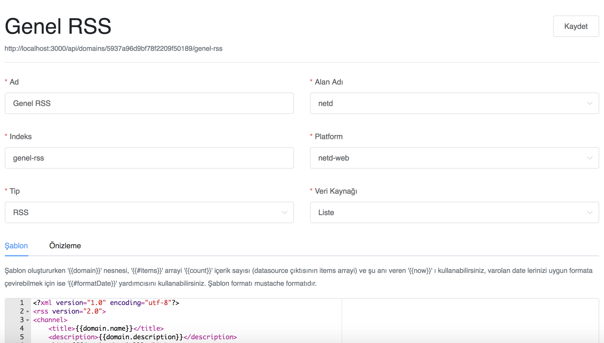

## Blupoint CMS Output Kullanım Dökümanı

Blupoint CMS Output Blupoint CMS'in veri kaynaklarını kullanarak xml/json/sitemap/rss gibi public çıktılar üretilmesini sağlayan bir araçtır.

Blupoint CMS Output üzerinde sınırsız sayıda farklı türlerde çıktı üretilebilir.



Çıktılar [mustache](http://mustache.github.io/mustache.5.html) şablon yapıcı aracılığıla üretiliyor. 

Mustache şablonuna gönderilen veriler

```javascript
{
    domain: _domain, // Seçili domain objesi
    items: _items, // Veri kaynağının çıktısındaki data.items arrayi
    count: data.data.count, // Veri kaynağı çıkstındaki count
    now: _now, // ilgili şablon örneğinin tarih formatı
    formatDate: _formatDate() // Tarihi ilgili şablon örneği formatına dönüştüen yardımcı fonksiyon
}
```

``` xml
<?xml version="1.0" encoding="utf-8"?>
<rss version="2.0">
<channel>
    <title>{{domain.name}}</title>
    <description>{{domain.description}}</description>
    <link>{{{domain.domain}}}</link>
    <language>TR</language>
    <copyright>{{copyrightInfo}}</copyright>
    <pubDate>{{now}}</pubDate>
    <lastBuildDate>{{now}}</lastBuildDate>
    {{#items}}
    <item>
        <title>{{title}}</title>
        <description>{{description}}</description>
        <link>{{{domain.domain}}}{{{url}}}</link>
        <guid>{{{domain.domain}}}{{{url}}}</guid>
        <pubDate>{{#formatDate}}{{sys.published_at}}{{/formatDate}}</pubDate>
    </item>
    {{/items}}
</channel>
</rss>
```

Mushache logic-less bir şablon yapıcı olduğu için bazı yardımcı fonksiyonlara ihtiyaç olacaktır, bu nedenle Blupoint CMS Output yardımcı fonksiyonları yazacak bir arayüz sunar.

Bu arayüz sayesinde yukarıdaki formatDate yardımcı fonksiyonu gibi ek fonksiyonları siz de yazabilirsiniz

Örnek olarak, bir tagHelper yardımcı fonksiyonu ile tagleri virgül ile ayıran bir yapı kurulabilir.

``` javascript
tagHelper = 
```

``` javascript
function () {
  return this.tags.map(x => x.tag).join(', ')
}
```

Çıktılardaki html ya da xml tipindeki yapıları manipule edebilmek amacıyla items arrayindeki her öğeye [__cheerio](https://github.com/cheeriojs/cheerio) yardımcısı eklenmiştir bu sayede aşağıdaki örnekteki gibi çıktıdaki html/xml alanlar jquery benzeri bir yapı ile manipule edilebilir.

``` javascript
htmlHelper = 
```

``` javascript
function () {
  // item ı al ve self olarak eşitle
  var self = this
  return function (text, render) {
    // template te kullanılan texti al, örneğin {{text}}
    var _text = render(text)
    // texti cheerio da kullanılak hale getir
    var $ = self.__cheerio.load(_text, {xml:true})
    // jquery benzeri bir yapı ile html i manipule et
    $('p').addClass('abb')
    // html i encode et
    return $('<div/>').text($.html()).html()
  } 
}
```

Çıktılar preview ekranı aracılığla henüz kaydedilmeden önizlenebilir, önizleme sonucun kaydedilerek ekran üzerinde sunulan ilgili link üzerinden görüntülenebilir.

Veri kaynaklarındaki parametler preview tabında kullanıldığı gibi çıktı urlinin sonunda da querystring oalrak kullanılabilir, bu sayede sitemap index içerisindeki farklı page lerde farklı türlerde içerikleri sunan sitemapler oluşturulabilir.